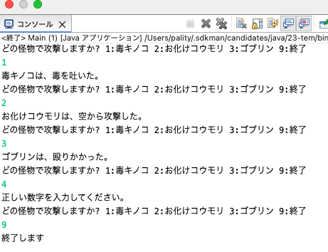
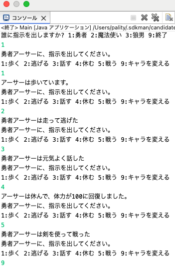
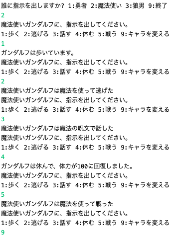
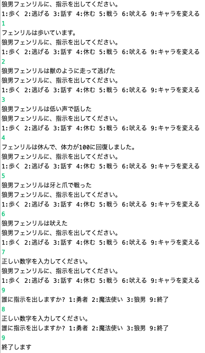

# Java 課題レポート - 第10回
**学籍番号**: 24024
**名前**: 白石鷹也
**授業日**: 11/08

## 練習15
### ソースコード
怪物クラスです。抽象クラスとして定義。
```java
package period10.Practice15;

public abstract class Monster {
    protected int hp;
    protected String name;

    public Monster(String name, int hp) {
        this.name = name;
        this.hp = hp;
    }

    // 抽象メソッド「戦う」
    public abstract void fight();
}
```

お化けコウモリのクラスです。
```java
package period10.Practice15;

public class GhostBat extends Monster {
    public GhostBat() {
        super("お化けコウモリ", 40); // 名前とHPを設定
    }

    @Override
    public void fight() {
        System.out.println(name + "は、空から攻撃した。");
    }
}
```

<div style="page-break-before:always"></div>

ゴブリンのクラスです。
```java
package period10.Practice15;

public class Goblin extends Monster {
    public Goblin() {
        super("ゴブリン", 60); // 名前とHPを設定
    }

    @Override
    public void fight() {
        System.out.println(name + "は、殴りかかった。");
    }
}
```

毒キノコのクラスです。
```java
package period10.Practice15;

public class PoisonMatango extends Monster {
    public PoisonMatango() {
        super("毒キノコ", 50); // 名前とHPを設定
    }

    @Override
    public void fight() {
        System.out.println(name + "は、毒を吐いた。");
    }
}
```

<div style="page-break-before:always"></div>

メインクラスです。
```java
package period10.Practice15;

import java.util.Scanner;

public class Main {
    public static void main(String[] args) {
        try (Scanner scanner = new Scanner(System.in)) {
            // 各怪物のインスタンスを生成
            PoisonMatango poisonMatango = new PoisonMatango();
            GhostBat ghostBat = new GhostBat();
            Goblin goblin = new Goblin();

            while (true) {
                System.out.println("どの怪物で攻撃しますか? 1:毒キノコ 2:お化けコウモリ 3:ゴブリン 9:終了");
                int choice = scanner.nextInt();

                switch (choice) {
                    case 1:
                        poisonMatango.fight();
                        break;
                    case 2:
                        ghostBat.fight();
                        break;
                    case 3:
                        goblin.fight();
                        break;
                    case 9:
                        System.out.println("終了します");
                        return;
                    default:
                        System.out.println("正しい数字を入力してください。");
                }
            }
        }
    }
}
```
<div style="page-break-before:always"></div>

### 実行結果


<div style="page-break-before:always"></div>

## 練習16
### ソースコード
登場人物クラスです。
```java
package period10.Practice16;

public interface Character {
    void walk();
    void run();
    void talk();
    void sleep();
    void attack();
}
```

人間クラスです。
```java
package period10.Practice16;

public abstract class Human implements Character {
    protected String name;
    protected int hp;

    public Human(String name) {
        this.name = name;
        this.hp = 100;
    }

    @Override
    public void walk() {
        System.out.println(name + "は歩いています。");
    }

    @Override
    public void sleep() {
        hp = 100;
        System.out.println(name + "は休んで、体力が" + hp + "に回復しました。");
    }

    @Override
    public abstract void run();

    @Override
    public abstract void talk();
}
```

<div style="page-break-before:always"></div>

ヒーロークラスです。
```java
package period10.Practice16;

public class Hero extends Human {
    public Hero(String name) {
        super(name);
    }

    @Override
    public void run() {
        System.out.println("勇者" + name + "は走って逃げた");
    }

    @Override
    public void talk() {
        System.out.println("勇者" + name + "は元気よく話した");
    }

    @Override
    public void attack() {
        System.out.println("勇者" + name + "は剣を使って戦った");
    }
}
```

ウィザードクラスです。
```java
package period10.Practice16;

public class Wizard extends Human {
    public Wizard(String name) {
        super(name);
    }

    @Override
    public void run() {
        System.out.println("魔法使い" + name + "は魔法を使って逃げた");
    }

    @Override
    public void talk() {
        System.out.println("魔法使い" + name + "は魔法の呪文で話した");
    }

    @Override
    public void attack() {
        System.out.println("魔法使い" + name + "は魔法を使って戦った");
    }
}
```

<div style="page-break-before:always"></div>

怪物クラス（インターフェース）です。
```java
package period10.Practice16;


public interface Monster {
    void howl();
}
```

狼男クラスです。
```java
package period10.Practice16;


public class Werewolf extends Human implements Monster {
    public Werewolf(String name) {
        super(name);
    }

    @Override
    public void run() {
        System.out.println("狼男" + name + "は獣のように走って逃げた");
    }

    @Override
    public void talk() {
        System.out.println("狼男" + name + "は低い声で話した");
    }

    @Override
    public void attack() {
        System.out.println("狼男" + name + "は牙と爪で戦った");
    }

    @Override
    public void howl() {
        System.out.println("狼男" + name + "は吠えた");
    }
}
```

<div style="page-break-before:always"></div>

メインクラスです。
```java
package period10.Practice16;

import java.util.Scanner;

public class Main {
    public static void main(String[] args) {
        try (Scanner scanner = new Scanner(System.in)) {
            // 各キャラクターのインスタンスを生成
            Hero hero = new Hero("アーサー");
            Wizard wizard = new Wizard("ガンダルフ");
            Werewolf wolfman = new Werewolf("フェンリル");

            while (true) {
                System.out.println("誰に指示を出しますか? 1:勇者 2:魔法使い 3:狼男 9:終了");
                int choice = scanner.nextInt();

                switch (choice) {
                    case 1:
                        characterAction(hero, scanner, "勇者");
                        break;
                    case 2:
                        characterAction(wizard, scanner, "魔法使い");
                        break;
                    case 3:
                        WerewolfAction(wolfman, scanner);
                        break;
                    case 9:
                        System.out.println("終了します");
                        return;
                    default:
                        System.out.println("正しい数字を入力してください。");
                }
            }
        }
    }

    private static void characterAction(Human character, Scanner scanner, String characterType) {
        while (true) {
            System.out.println(characterType + character.name + "に、指示を出してください。");
            System.out.println("1:歩く 2:逃げる 3:話す 4:休む 5:戦う 9:キャラを変える");
            int command = scanner.nextInt();

            switch (command) {
                case 1:
                    character.walk();
                    break;
                case 2:
                    character.run();
                    break;
                case 3:
                    character.talk();
                    break;
                case 4:
                    character.sleep();
                    break;
                case 5:
                    character.attack();
                    break;
                case 9:
                    return;
                default:
                    System.out.println("正しい数字を入力してください。");
            }
        }
    }

    private static void WerewolfAction(Werewolf wolfman, Scanner scanner) {
        while (true) {
            System.out.println("狼男" + wolfman.name + "に、指示を出してください。");
            System.out.println("1:歩く 2:逃げる 3:話す 4:休む 5:戦う 6:吠える 9:キャラを変える");
            int command = scanner.nextInt();

            switch (command) {
                case 1:
                    wolfman.walk();
                    break;
                case 2:
                    wolfman.run();
                    break;
                case 3:
                    wolfman.talk();
                    break;
                case 4:
                    wolfman.sleep();
                    break;
                case 5:
                    wolfman.attack();
                    break;
                case 6:
                    wolfman.howl();
                    break;
                case 9:
                    return;
                default:
                    System.out.println("正しい数字を入力してください。");
            }
        }
    }
}
```

### 実行結果
<ul>
  <li></li>
  <li></li>
  <li></li>
</ul>

<style>
  ul {
    display: flex;
    justify-content: center;
  }

  li {
    list-style: none;
  }
</style>